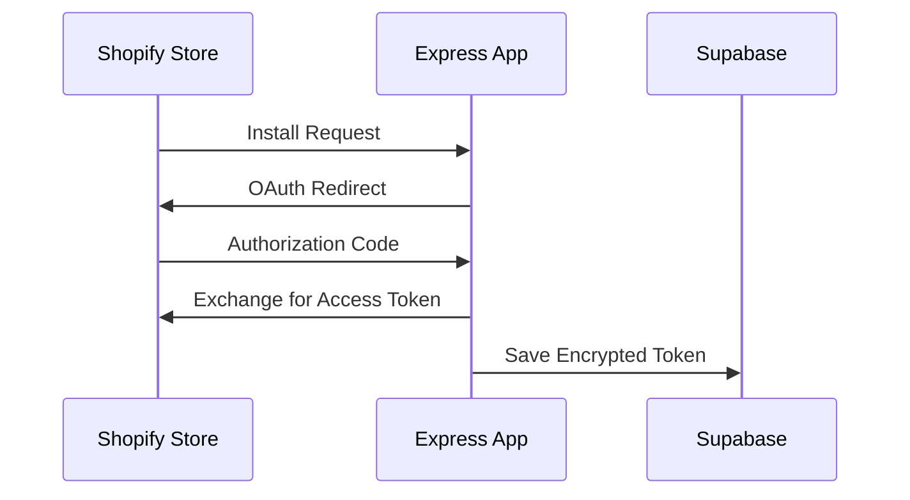

# Shopify 在庫アラートアプリ - 設計仕様書

> **概要**: Shopifyストアの在庫切れによる機会損失を防ぐ、リアルタイム監視ソリューション（MVP / 技術検証用プロトタイプ）
>
> **開発背景**: Shopify Plusパートナーとしての実務を想定し、ストア運営者が抱える「在庫管理コスト」と「販売機会の最大化」というビジネス課題を解決するために設計・構築しました。

**主要リンク**: [デモURL（準備中）](#) | [GitHub Repository](https://github.com/[YOUR_USERNAME]/shopify-app-practice)

---

## 💡 ビジネスバリュー (Business Impact)

本アプリケーション導入による想定効果：

1.  **機会損失の極小化 (Revenue)**
    * 在庫切れ検知から補充までのリードタイムを短縮し、販売機会を逃さない体制を構築。
2.  **運用工数の削減 (Cost)**
    * 担当者が管理画面を巡回する時間を「ゼロ」にし、通知が来た時だけ対応する運用へ変革（想定工数削減：約70%）。
3.  **スケーラブルな店舗運営 (Scale)**
    * 多店舗展開時も、通知システムの一元化により管理コストを比例させない設計。

---

## 🎯 プロジェクト概要

### 課題認識
Shopifyストア運営において、以下の課題解決を目指しました。
- 人気商品の在庫切れによる販売機会の喪失
- 手動での在庫チェックによる人的リソースの浪費
- 複数店舗運営時の在庫管理の複雑化

### 解決策
Shopify Admin APIと連携し、在庫数が設定した閾値を下回った瞬間にSlackへ自動通知を行う監視システムを構築。

---

## 🏗️ 設計思想・アーキテクチャ

### 設計方針

#### 1. **シンプルさ重視のMVP設計**
- ビジネスロジックの検証を最優先し、初期リリースは必要最小限の機能に絞り込み。
- 3層アーキテクチャ（プレゼンテーション / ビジネスロジック / データ）を意識し、将来の拡張に耐えうる設計。

#### 2. **OAuth 2.0による安全な認証フロー**



- Shopify標準のOAuth認証フローを実装。
- アクセストークンは暗号化してSupabaseに永続化。

#### 3. **疎結合な通知システム**
- Slack Webhook APIを使用した非同期通知を採用。
- 通知ロジックを抽象化し、将来的にEmail、LINE、Discord等へのマルチチャネル展開を容易にする設計。

---

## 🔧 技術選定理由

### バックエンド: Node.js + Express

**選定理由**:
| 項目 | 理由 |
|------|------|
| **開発速度** | 軽量なFWにより、プロトタイピングのサイクルを最速化 |
| **エコシステム** | Shopify公式ライブラリとの親和性が高く、API連携がスムーズ |
| **非同期処理** | Webhookや大量の在庫データ処理（I/Oバウンド）に最適 |

### データベース: Supabase (PostgreSQL)

**選定理由**:
| 項目 | 理由 |
|------|------|
| **セキュリティ** | RLS (Row Level Security)により、テナントごとのデータ分離をDBレベルで保証可能 |
| **スケーラビリティ** | マネージドサービスのため、インフラ管理コストを削減しつつ水平スケールに対応 |

### フロントエンド: EJS + Vanilla JS

**選定理由 (Why EJS?):**
本フェーズ（MVP）では、**「ビジネスロジックの検証」と「API連携の安定性確保」にリソースを集中させる戦略**を取りました。
複雑なSPA構成（ビルド環境、状態管理）を避け、サーバーサイドレンダリング(SSR)を採用することで、限られた期間内でバックエンドの堅牢性を高めています。
※ 次期フェーズ（UX向上）にて React/Remix への移行を設計済みです。

---

## 📐 システムアーキテクチャ

### フロー図

```text
┌─────────────┐      ┌──────────────┐      ┌─────────────┐
│   Admin     │─────>│  Express App │─────>│  Supabase   │
│ (Browser)   │<─────│   (Node.js)  │<─────│ (PostgreSQL)│
└─────────────┘      └──────────────┘      └─────────────┘
                            │
                            │ Shopify Admin API
                            ▼
                     ┌──────────────┐
                     │   Shopify    │
                     │    Store     │
                     └──────────────┘
                            │
                            │ Webhook通知
                            ▼
                     ┌──────────────┐
                     │    Slack     │
                     │   Workspace  │
                     └──────────────┘
```

### 将来の推奨構造（リファクタリング案）

現在はMVPとして単一ファイルに集約していますが、以下のようなService層への分離を設計しています。

```text
src/
├── controllers/          # リクエストハンドラー
├── services/             # ビジネスロジック (InventoryService, NotificationService)
├── models/               # データモデル
├── middlewares/          # 認証・バリデーション
└── config/               # 設定ファイル
```

---

## ⚙️ 主要機能

### 1. OAuth認証フロー
- **エンドポイント**: `GET /auth`
- Shopify標準のOAuth 2.0フローを実装し、セキュアなトークン交換を実現。
- State nonce検証によるリプレイアタック対策済み。

### 2. 在庫監視システム
- **エンドポイント**: `GET /check-inventory`
- **処理フロー**:
    1. Supabaseからアラート設定を取得
    2. Shopify Admin APIで最新在庫を確認
    3. 閾値判定を行い、条件合致時にSlack通知を発火

### 3. アラート設定管理
- ストア管理者が商品ごとに閾値を設定可能なダッシュボード機能。
- バリデーション実装により不正なデータ入力を防止。

---

## 🔒 セキュリティ対策

### 実装済みの対策

| 脅威 | 対策 | 実装箇所 |
|------|------|----------|
| **XSS** | EJSの自動エスケープ機能を利用 | View層 |
| **SQLインジェクション** | パラメータ化クエリの使用 | DB層 |
| **認証情報の漏洩** | 環境変数(.env)による管理とGitHubへのアップロード除外 | 設定 |
| **データプライバシー** | **重要:** 本アプリは在庫データのみを扱い、購入者の個人情報（PII）は一切保存しません | 設計全体 |

### 今後の改善項目
- CSRFトークン検証の導入
- セッション管理の実装（express-session）
- Webhook署名検証（HMAC）

---

## 🚀 開発・運用体制

### CI/CDパイプライン
**GitHub Actions** を利用し、コード品質の維持とデプロイを自動化。
- Lintチェック (ESLint)
- 自動デプロイ (Render.com)

### 監視・ログ管理
現状はRenderのログ機能を利用していますが、本番運用時は Datadog や Sentry の導入により、エラー検知とパフォーマンス監視を強化する設計です。

---

## 🌱 拡張性・将来構想

### Phase 1 (MVP) - 完了
- ✅ 基本的なアラート機能、Slack通知、手動在庫チェック

### Phase 2 (3ヶ月以内)
- 🔲 自動定期実行（Cron / スケジューラー）
- 🔲 通知履歴の記録・分析機能
- 🔲 テストコード実装（Vitest, カバレッジ目標80%）

### Phase 3 (6ヶ月以内)
- 🔲 マルチチャネル通知（Email、SMS）
- 🔲 マイクロサービス分割（Notification Serviceの独立）
- 🔲 管理画面のReact化

---

## 🎬 デモ・操作方法

### ダッシュボード画面

*(※ 実際の画面キャプチャを docs/demo.png に配置してください)*

### 動作デモ（想定シナリオ）
1. 管理者がダッシュボードで「商品A」の在庫閾値を「10」に設定
2. 在庫チェックを実行
3. 在庫が8個の場合、Slackに以下のアラートが即座に通知される
   > 📦 **在庫アラート**: 商品A の在庫が少なくなっています（残り8個）

---

## 📚 技術スタック詳細

- **Runtime**: Node.js (v22.x)
- **Framework**: Express (v5.2.1)
- **Template Engine**: EJS
- **Database**: Supabase (PostgreSQL)
- **Infrastructure**: Render.com, GitHub Actions
- **Tools**: ESLint, Husky, Vitest

---

## 🙋‍♂️ 質問・フィードバック歓迎

このプロジェクトについてご質問やフィードバックがありましたら、お気軽にご連絡ください。

**連絡先**:
- GitHub: [https://github.com/あなたのユーザー名](https://github.com/あなたのユーザー名)
- Email: [あなたのメールアドレス]

---

**最終更新**: 2026年1月17日